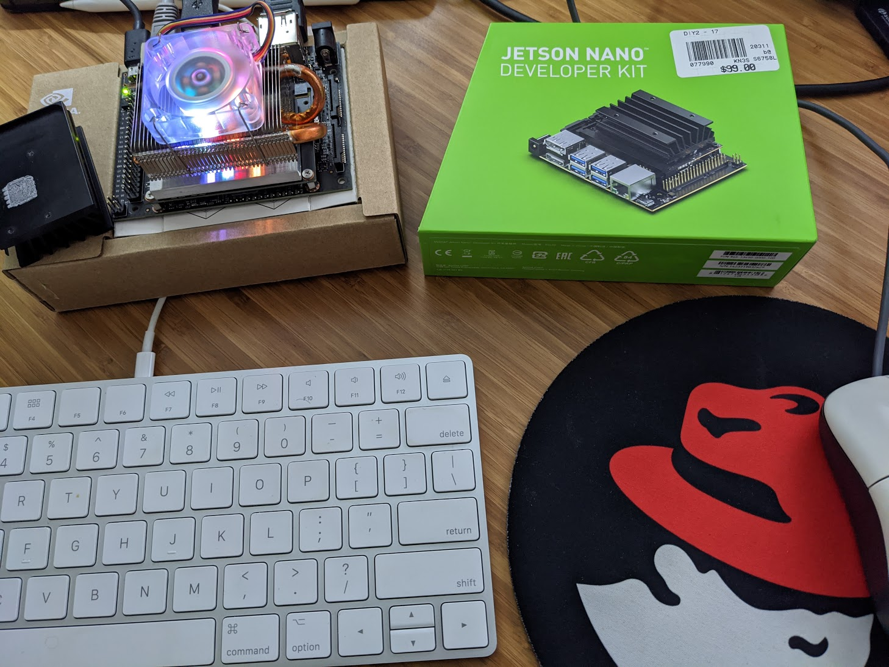

# Nvidia Jetson Nano (LinuxRevolution.com)

I picked up an NVIDIA Jetson Nano Development Kit from my local Microcenter.  Why?  Good question.  I have 3 tons of stuff I should be focusing on and learning.  But, sitting through numerous discussions at Red Hat and watching some of the videos that get mentioned frequently, I thought this seems like it could be a fun "hobby".  

Now, I was on the fence and had actually talked myself out of it, until someone mentioned something about being a "python nerd".  I have *wanted* to learn Python for a LONG time now - and without something to do or chase as a goal, it never really "took hold".  I am hoping that with this particular challenge in front of me, learning Python will finally occur.

[Foo - random stuff](./Foo)  
[Scripts - things I use to manage my environment](./Scripts)

